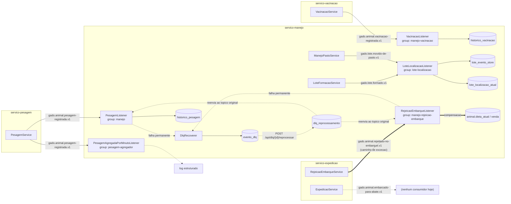

# Arquitetura — sistema de venda e embarque de gado de corte

Este documento descreve o sistema para quem for mantê-lo sem ter participado de nenhuma decisão — sem contexto prévio do domínio, chegando a ele por um incidente. Ele explica o sistema, não a disciplina em que foi construído.

## 1. O domínio

O sistema coordena o ciclo comercial de um animal numa operação de confinamento de gado de corte: do cadastro na fazenda até o embarque para o frigorífico. Antes dele, essa coordenação acontecia por planilhas e telefonemas entre recepção, zootecnia, sanidade, comercial e expedição, sem um registro único e ordenado do que aconteceu com cada animal.

A pergunta que o sistema responde é: **o que é verdade sobre este animal (ou este lote) agora, e dá para provar que aconteceu na ordem em que realmente aconteceu?** Três decisões de negócio dependem diretamente disso:

- formar um lote exige saber o peso e a idade atuais de cada animal candidato;
- aprovar uma venda exige que o peso do animal (ou do lote) atinja a meta mínima acordada em contrato com o frigorífico;
- aceitar um embarque exige que a vacinação do animal esteja em dia — o frigorífico recusa na triagem quem não estiver.

O sistema não cobre o processo inteiro da fazenda: manejo reprodutivo, genética do rebanho e gestão de insumos ficam de fora deliberadamente (ver ADR-002, seção "Consequências aceitas").

## 2. Os eventos

Seis fatos de negócio, cada um publicado por um serviço, cada um com contrato escrito:

| Evento | Tópico | Publicado por | Por que existe |
|---|---|---|---|
| `PesagemRegistrada` | `gado.animal.pesagem-registrada.v1` | `servico-pesagem` | Histórico de peso reprocessável — sustenta formação de lote, dieta e a decisão de embarque. |
| `VacinacaoRegistrada` | `gado.animal.vacinacao-registrada.v1` | `servico-vacinacao` | Carteira de vacinação em dia é pré-requisito de embarque. |
| `LoteFormado` | `gado.lote.formado.v1` | `servico-manejo` | Origem do stream de localização do lote (event sourcing, ADR-005). |
| `LoteMovidoDePasto` | `gado.lote.movido-de-pasto.v1` | `servico-manejo` | Atualiza a localização do lote — o segundo fato do mesmo stream. |
| `AnimalEmbarcadoParaAbate` | `gado.animal.embarcado-para-abate.v1` | `servico-expedicao` | O fato final do ciclo comercial — o caminho feliz do embarque. |
| `AnimalRejeitadoNoEmbarque` | `gado.animal.rejeitado-no-embarque.v1` | `servico-expedicao` | O caminho de exceção: o frigorífico recusou o animal na triagem. Dispara a compensação (Seção 5). |

Contratos completos, campo a campo, em [`docs/contrato.md`](contrato.md) (`VacinacaoRegistrada` e `AnimalRejeitadoNoEmbarque`), [`docs/contrato-pesagem.md`](contrato-pesagem.md), [`docs/contrato-lote-formado.md`](contrato-lote-formado.md), [`docs/contrato-lote-movido-de-pasto.md`](contrato-lote-movido-de-pasto.md) e [`docs/contrato-embarque.md`](contrato-embarque.md).

## 3. O desenho

| Tópico | Chave de partição | Partições | Quem consome (`group.id`) |
|---|---|---|---|
| `gado.animal.pesagem-registrada.v1` | `animalId` | 3 | `PesagemListener` (`manejo`), `PesagemAgregadaPorMinutoListener` (`pesagem-agregador`) |
| `gado.animal.vacinacao-registrada.v1` | `animalId` | 3 | `VacinacaoListener` (`manejo-vacinacao`) |
| `gado.lote.formado.v1` | `loteId` | 3 | `LoteLocalizacaoListener` (`lote-localizacao`) |
| `gado.lote.movido-de-pasto.v1` | `loteId` | 3 | `LoteLocalizacaoListener` (`lote-localizacao`) |
| `gado.animal.embarcado-para-abate.v1` | `animalId` | 3 | nenhum hoje (Seção 8) |
| `gado.animal.rejeitado-no-embarque.v1` | `animalId` | 3 | `RejeicaoEmbarqueListener` (`manejo-rejeicao-embarque`) |

Quatro serviços Maven independentes, sem módulo compartilhado — cada lado declara a própria classe do evento que consome, deliberadamente menos completa que a do publisher (consumidor tolerante). `servico-manejo` concentra a maior parte do estado do sistema: é publisher de dois eventos (`LoteFormado`, `LoteMovidoDePasto`) e consumidor de cinco tópicos, todos escrevendo no mesmo PostgreSQL.

Duas chaves de partição coexistem por design, não por acidente — `animalId` para fatos de nível de animal, `loteId` para fatos de nível de lote (ADR-003 justifica a escolha e o que ela deixa de responder).

### Diagrama — fluxo completo, caminho feliz e caminho de exceção

Linhas duplas (`==>`) marcam o caminho de exceção da Saga; linhas tracejadas (`-.->`) marcam os dois caminhos que só existem quando algo dá errado (a DLQ) ou quando não existe ainda (o consumidor de embarque).

## 4. As decisões

Quatro ADRs, cada um com a consequência que a equipe aceitou ao decidir — não a vantagem, o custo:

| ADR | Decisão | Consequência aceita |
|---|---|---|
| [ADR-002](adr/ADR-002-dominio-do-projeto.md) | O domínio é o ciclo comercial do animal, do cadastro ao embarque | Manejo reprodutivo, genética do rebanho e gestão de insumos ficam fora do sistema. |
| [ADR-003](adr/ADR-003-chave-de-particao.md) | Duas chaves de partição — `animalId` por animal, `loteId` por lote | A ordem causal exata entre um fato de lote e um fato de animal não é respondida sem repartir ou juntar os dois streams do lado do consumidor. |
| [ADR-005](adr/ADR-005-event-sourcing.md) | Localização do lote é event-sourced (event store + projeção descartável) | A leitura da localização deixa de ser um `SELECT` instantâneo — passa a ter defasagem real entre o evento e a projeção refletir isso. |
| [ADR-006](adr/ADR-006-resiliencia.md) | DLQ permanente em PostgreSQL + Saga coreografada | A DLQ acumula e não se auto-reprocessa; a coreografia não dá visibilidade única do progresso de uma saga específica. |

## 5. Quando falha

### O caminho de falha (Parte A)

`PesagemListener` e `RejeicaoEmbarqueListener` usam ack-mode MANUAL: o offset só é confirmado depois que o efeito de negócio comitou. Quando o processamento falha, o `DefaultErrorHandler` do container retenta com `FixedBackOff(1000ms, 2)` — dois reagendamentos curtos, suficientes para absorver uma falha transitória (timeout de rede, deadlock momentâneo no banco). Se a falha persistir (poison message que não desserializa, ou uma regra de negócio que sempre lança — por exemplo, um evento referenciando um animal inexistente), o `DlqRecoverer` grava a falha na tabela `evento_dlq`, de forma permanente: payload (ou os bytes originais, no caso de poison message), o envelope CloudEvents inteiro capturado dos headers, a exceção raiz e a posição Kafka exata (tópico/partição/offset). Só depois dessa gravação o offset original é confirmado — a partição nunca trava esperando uma mensagem que nunca vai processar, e nada é descartado em silêncio.

O reprocessamento é manual: `POST /api/dlq/{id}/reprocessar` reenvia o payload gravado de volta ao tópico original, com os cabeçalhos restaurados. Reprocessar não altera a linha original — cada tentativa vira uma linha em `dlq_reprocessamento`. Reprocessar o mesmo evento mais de uma vez não duplica o efeito de negócio, porque a idempotência por `eventoId` (`evento_processado`) já protege contra reentrega em geral — reprocessamento manual é só mais uma forma de a mensagem chegar ao consumidor.

### A Saga de compensação (Parte B)

`AnimalRejeitadoNoEmbarque` é o caminho de exceção do domínio: o frigorífico recusou o animal na triagem. A Saga é **coreografada** — `servico-expedicao` publica o fato e não sabe (nem precisa saber) o que acontece depois; `servico-manejo` reage de forma independente, com seu próprio grupo de consumo, executando três efeitos na mesma transação do dedup: o animal permanece no lote de origem (reafirmação, não movimentação), a dieta é reavaliada (`animal.dieta_atual`, estado corrente, não histórico) e qualquer venda em aberto referenciando aquele animal é encerrada. Nenhum `UPDATE`/`DELETE` desfaz o fato original da recusa — a compensação é o que o `servico-manejo` faz a partir dele, não uma correção do passado.

**Se a própria compensação falhar** (por exemplo, o animal referenciado não existe em `servico-manejo`), o record cai na mesma `evento_dlq` descrita acima — a saga fica incompleta e **visível**: existe uma linha na DLQ dizendo exatamente que aquela recusa ainda não foi compensada, com o evento preservado para reprocessar depois que a causa for corrigida. Não existe um mecanismo de compensação-da-compensação separado.

## 6. Quando cresce

**O gargalo está na concorrência dos consumidores, não nas partições.** Todos os tópicos já têm 3 partições, mas nenhum `ConcurrentKafkaListenerContainerFactory` do sistema define `setConcurrency` — o padrão do Spring Kafka é 1, então cada `group.id` roda hoje com uma única thread consumindo uma partição de cada vez, mesmo havendo três disponíveis. Sob carga, aumentar a concorrência até 3 (o número de partições) é o primeiro botão a girar — não exige nenhuma mudança na forma como os eventos são publicados ou particionados, só configuração.

**`servico-manejo` é o serviço que mais cedo sentiria pressão.** Ele hospeda seis listeners e é o único ponto de escrita no PostgreSQL compartilhado por todo o domínio (histórico de peso, vacinação, event store de lote, DLQ, compensação). Escalar os outros três serviços (pesagem, vacinação, expedição) é trivial — são publishers sem estado, várias instâncias dividem o trabalho de aceitar HTTP e publicar no Kafka sem coordenação nenhuma. Escalar `servico-manejo` horizontalmente (mais de uma instância do processo) já funciona para os consumidores Kafka (cada `group.id` naturalmente distribui partições entre instâncias), mas todas as instâncias continuam escrevendo no mesmo Postgres — esse banco, não o Kafka, seria o próximo gargalo.

**O que a chave de partição limita:** como o ADR-003 já registra, nenhuma pergunta que precise da ordem causal exata *entre* um evento de lote e um evento de animal (ex.: "esse animal já tinha sido pesado antes do lote mudar de pasto?") tem resposta garantida pela ordem de partição — só por comparação de `ocorridoEm`, que é ordem de negócio, não ordem estrutural do broker. Crescer o sistema nessa direção exigiria uma projeção que junte os dois streams do lado do consumidor, não uma chave de partição nova.

## 7. O que se enxerga

Três perguntas que dá para responder hoje, às 3 da manhã, e com que sinal:

1. **"O consumidor de pesagem está processando, ou parou?"** Sinal: o log estruturado do `PesagemListener` (uma linha por evento efetivamente processado, com `eventoId`/`animalId`/`pesoKg`) e o consumer lag do grupo `manejo`, visível no Kafka UI (`http://localhost:8081`, listado no README). Lag crescendo sem log novo aparecendo é o consumidor parado.
2. **"Tem coisa acumulando na DLQ que precisa de atenção?"** Sinal: `GET /api/dlq` — cada linha traz o motivo da falha, o tópico de origem e quando aconteceu. Uma contagem crescente (`GET` retornando cada vez mais linhas) é o sinal de que algo sistemático está falhando, não um evento isolado.
3. **"A localização registrada de um lote está desatualizada?"** Sinal: comparar `lote_localizacao_atual.versao_da_projecao` com a versão mais alta gravada para aquele `loteId` em `lote_evento_store` — se a projeção está atrás, `POST /api/lotes/{id}/localizacao/reconstruir` resolve por replay.

Uma pergunta que **não** tem sinal hoje, vale nomear: "esse animal específico está com a vacinação em dia?" não tem endpoint — só uma consulta SQL direta em `historico_vacinacao` (o repositório existe, o controller que exporia isso não foi construído). Está listado como pendência na Seção 8.

## 8. O que ficou de fora

- **Consumidor de `AnimalEmbarcadoParaAbate`.** O evento é publicado, mas nada o lê — não existe hoje uma projeção de "quais animais já foram embarcados" nem uma auditoria do caminho feliz do embarque, só do caminho de exceção. Seria preciso um `Listener` novo em `servico-manejo`, no mesmo padrão dos demais.
- **Endpoint de consulta ao histórico de vacinação.** `HistoricoVacinacaoRepository` já tem os métodos; falta um `VacinacaoConsultaController` (ou equivalente) expondo isso via HTTP — hoje só é visível direto no banco.
- **Reprocessamento automático da DLQ.** O caminho manual (`POST /api/dlq/{id}/reprocessar`) existe; um agendador que tentasse reprocessar sozinho depois de N minutos não foi construído, de propósito — decidir quando algo está corrigido é humano, nesta etapa.
- **Snapshot no event store do ADR-005.** O replay de `lote_evento_store` sempre lê o stream inteiro do início. Para os volumes de hoje (um lote muda de pasto algumas vezes) isso é irrelevante; se o padrão de uso mudar, precisaria de um ponto de partida gravado.
- **Orquestração da Saga.** A coreografia atual cobre bem um caminho de exceção com dois participantes. Se a saga crescer (mais passos, mais compensações encadeadas), essa decisão precisaria ser revisitada — nomeado como consequência aceita no ADR-006.
- **Autenticação e autorização nos endpoints REST.** Nenhum dos quatro serviços exige credencial para publicar ou consultar. Aceitável para o escopo desta disciplina; seria bloqueante para qualquer ambiente real.
- **Métricas e rastreamento distribuído.** A observabilidade de hoje é log estruturado por serviço mais o Kafka UI — não há um painel único, nem correlação automática entre um evento e o log que ele gerou em outro serviço além do `eventoId` aparecer em ambos.